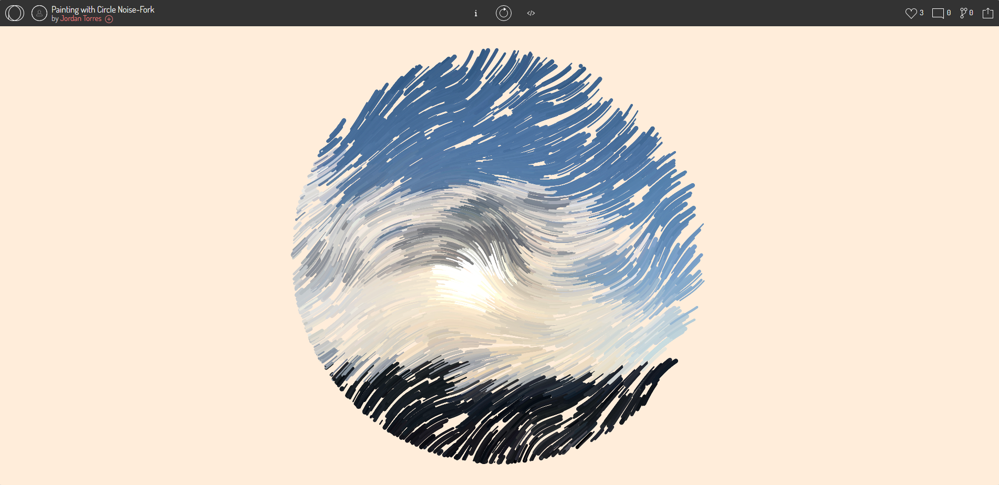
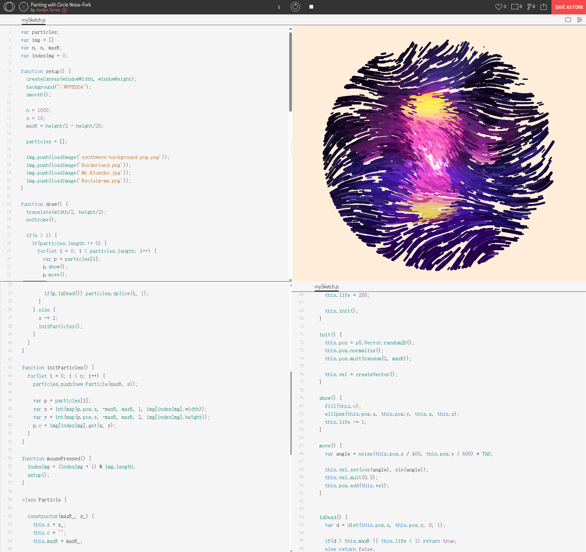

# json2677_9103_tut04
# Quiz 8
## Imaging Technique Inspiration
### **Painting with Circle Noise-Fork by Jordan Torres from Openprocessing**

The reason why I chose this inspiration because I'm planning to choose 'The Scream' by Edvard Munch from the artworks. The example is starting from many small particles and slowly transfroming into curved and colored lines, finally form a circle. The entire animation has four stages, each change starts from the previous end position. This shares similar feature when I looked closer into 'The Scream' artwork, it also has a lot of curved shapes and combined of different colored lines. This draws my attention to interpret it in geometric patterns and how to make the curved lines animated in the groupwork task.

[Inspiration link] (https://openprocessing.org/sketch/2232980)

## Coding Technique Exploration

I referred to the example of particles on p5.js and the sketch code of the inspiration which share similar feature of the animated particles. The coding technique used in this sketch is primarily object-oriented programming (OOP) with the use of classes and objects. The 'Particle' class is defined to encapsulate the behavior and properties of individual particles.The 'constructor' method initializes the properties of each particle object when it is instantiated. Methods like 'show()', 'move()', and 'isDead()' define the behavior of particles. These methods operate on the properties of the object they belong to. 'if()' and 'for loop' function is also provided to create multiple particles in motion.

[Inspiration link1] (https://p5js.org/examples/simulate-particles.html)

[Inspiration link2] (https://openprocessing.org/sketch/2232980)

